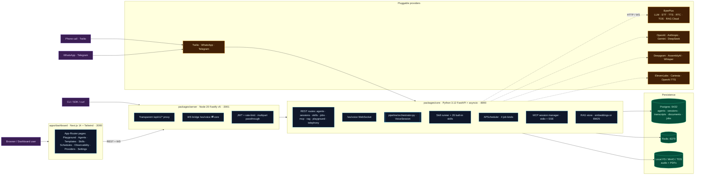
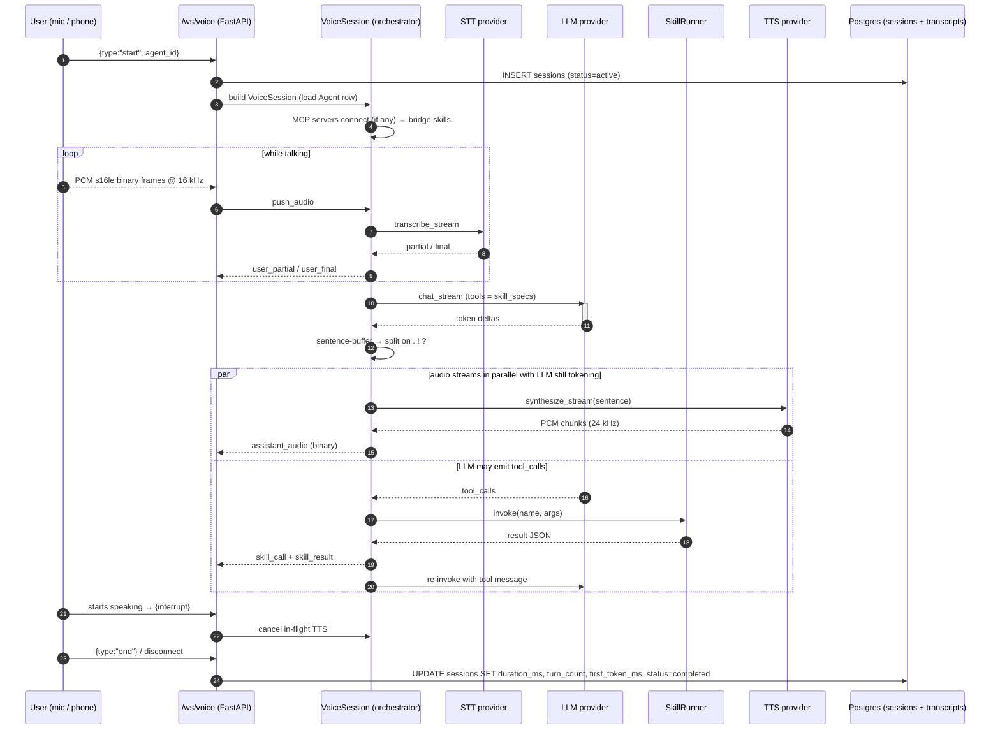
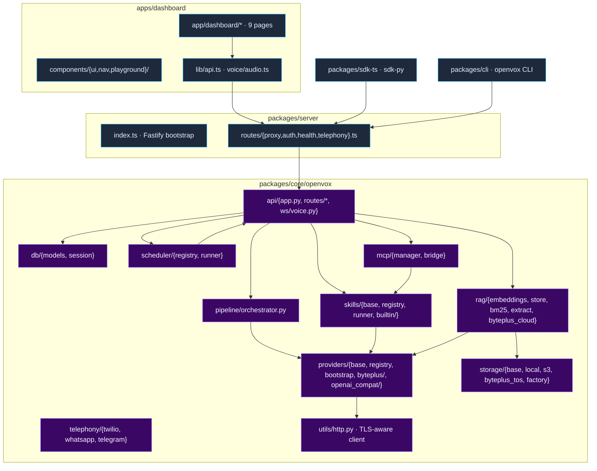
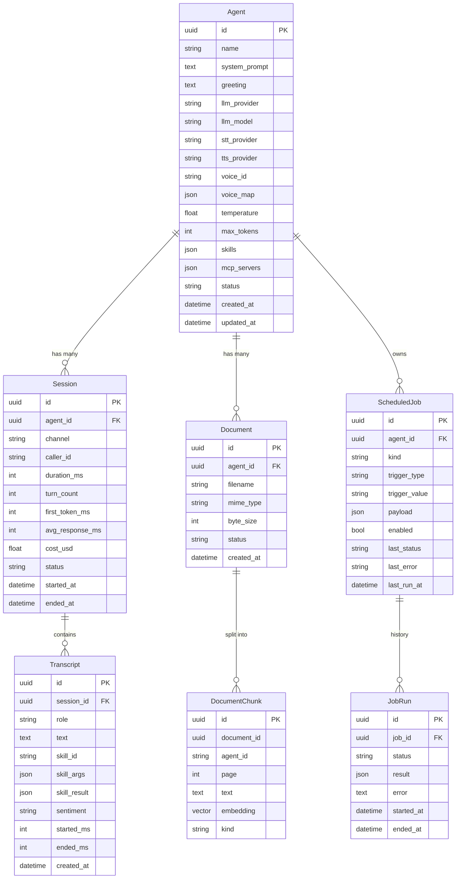
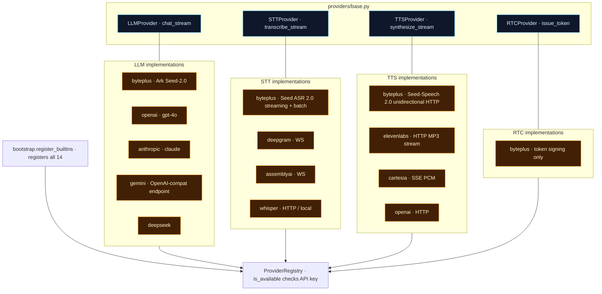
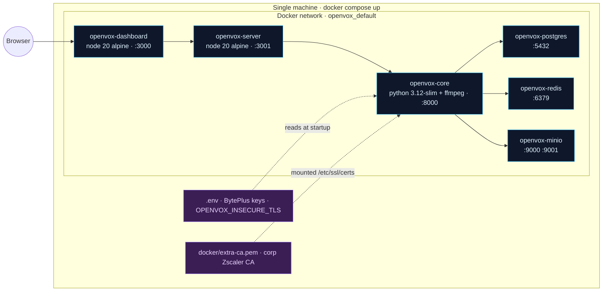

# OpenVox — Architecture Diagrams

Visual companion to [`architecture.md`](architecture.md). All diagrams use
[Mermaid](https://mermaid.js.org/) so they render natively on GitHub and in
most markdown viewers. Edit the source; the rendered version stays in sync.

For an explanation of *why* the design works (latency budget, sentence-flush
TTS, interruption handling), read `architecture.md`. This file shows
*what's wired to what*.

---

## 1. System overview — the three tiers

**Read the lanes top-to-bottom:** dashboard → gateway → core → persistence
and providers. The gateway is *transparent* — it doesn't transform payloads,
just adds auth, rate-limiting, multipart parsing, and a WS bridge. Almost
everything interesting happens in the core.

---

## 2. Voice pipeline — what happens during one call

**Three things make this fast:**
1. **Async generators** all the way down — no buffering between stages.
2. **Sentence-flush TTS** — audio starts streaming after the first
   `.` / `!` / `?`, not after the full LLM response.
3. **Interruption** — the user starting to speak cancels the in-flight TTS
   stream within one VAD frame.

---

## 3. Module map — where the code lives

---

## 4. Skills, Templates, Scheduler, MCP — the extensibility surface

```mermaid
flowchart LR
    classDef builtin fill:#064e3b,stroke:#34d399,color:#d1fae5
    classDef tpl fill:#3b1e54,stroke:#a78bfa,color:#e9d5ff
    classDef job fill:#422006,stroke:#f59e0b,color:#fef3c7
    classDef mcp fill:#1e3a8a,stroke:#60a5fa,color:#dbeafe

    subgraph Skills["26 Built-in Skills — skills/builtin/"]
        S1["general · get_time · web_search · calculator"]:::builtin
        S2["ecommerce · lookup_order · check_stock · start_return · route_to_specialist"]:::builtin
        S3["education · explain_concept"]:::builtin
        S4["stock · get_quote · technical_indicators"]:::builtin
        S5["voice_analysis · sentiment · profanity · transcribe_recording"]:::builtin
        S6["documents · query_documents · analyze_image"]:::builtin
        S7["reception · business_info · check_availability · book · cancel · list_appointments"]:::builtin
        S8["sales · fetch_next_lead · record_disposition · book_demo · qualified_leads"]:::builtin
        S9["language · detect_language"]:::builtin
    end

    subgraph Templates["8 Templates — api/routes/templates.py"]
        T1["ecommerce-support"]:::tpl
        T2["education-tutor"]:::tpl
        T3["stock-analyst"]:::tpl
        T4["receptionist"]:::tpl
        T5["sales-sdr"]:::tpl
        T6["document-qa"]:::tpl
        T7["multilingual-support"]:::tpl
        T8["voice-analyzer"]:::tpl
    end

    subgraph Scheduler["Scheduler — 4 job kinds"]
        J1["agent_query · LLM call against an agent"]:::job
        J2["skill_run · direct skill invoke"]:::job
        J3["audio_batch · folder walk + transcribe + analyze"]:::job
        J4["outbound_call_batch · Twilio dial top-N leads"]:::job
    end

    subgraph MCPArea["MCP — per-agent external tool servers"]
        M1["stdio transport · spawned subprocess"]:::mcp
        M2["SSE transport · HTTP stream"]:::mcp
        Mbridge["bridge: wraps remote tools as<br/>BaseSkill with id 'mcp__server__tool'"]:::mcp
    end

    Agent["Agent row · system_prompt · skills · voice_map · mcp_servers"]
    SessionRun["VoiceSession at runtime"]

    T1 -. instantiate .-> Agent
    T2 -. instantiate .-> Agent
    T3 -. instantiate .-> Agent
    T4 -. instantiate .-> Agent
    T5 -. instantiate .-> Agent
    T6 -. instantiate .-> Agent
    T7 -. instantiate .-> Agent
    T8 -. instantiate .-> Agent

    Skills -- "referenced by id" --> Agent
    MCPArea -- "bridged at start" --> SessionRun
    Agent --> SessionRun
    Scheduler -- "agent_id" --> Agent
    Scheduler -- "skill_id" --> Skills
```

**The three extensibility points** (covered in `docs/extending.md`):

| Point | What you add | Where |
|---|---|---|
| Skill | A `BaseSkill` subclass with `id` / `description` / `parameters` / `run()` | `~/.openvox/skills/*.py` or `pip install` with `openvox.skills` entry-point |
| Provider | An `STTProvider` / `TTSProvider` / `LLMProvider` / `RTCProvider` subclass | `openvox.providers` entry-point |
| Template | A dict entry in `TEMPLATES` | `packages/core/openvox/api/routes/templates.py` |
| MCP server | Per-agent config: `{name, transport, command, args, env}` | Dashboard MCP tab on the agent edit page |

---

## 5. Data model — the tables behind every page

**Cascade rules** (current — pre-Alembic, route-level):
- Delete `Agent` → cascade `Session` (built-in CASCADE), `Document` + `DocumentChunk` (in-route, Bug #30), `ScheduledJob` (in-route via FK), `JobRun` (in-route via FK on job).
- Delete `Session` → cascade `Transcript` (`cascade="all, delete-orphan"`).
- Delete `ScheduledJob` → cascade `JobRun` (in-route, Bug #29).

---

## 6. Provider plug-in surface — what swaps for what

**Key invariant**: every outbound HTTPS from a provider or skill goes through
`openvox/utils/http.py:make_async_client()` which honours
`OPENVOX_INSECURE_TLS` and `OPENVOX_EXTRA_CA_FILE`. Bare `httpx.AsyncClient`
in skills is a bug — see CLAUDE.md §8 #31.

---

## 7. Request paths cheat-sheet

| User action | Hits | Then |
|---|---|---|
| Visit dashboard | Next.js SSR / static | — |
| Open Playground / start voice call | `GET /ws/voice` (gateway → core WS bridge) | core `voice_ws()` → `VoiceSession` |
| Type message in Text tab | `POST /api/v1/playground/text` | core writes `Session` row, streams LLM tokens |
| Browse Templates | `GET /api/v1/templates` | static dict in `routes/templates.py` |
| "Use template" | `POST /api/v1/agents` (server-side template merge) | new `Agent` row |
| Upload a PDF | `POST /api/v1/agents/{id}/documents` (multipart) | core extracts → chunks → embeds-or-BM25 → stores |
| Ask a document question | `POST /api/v1/playground/document_query` | RAG retrieve → multimodal LLM call |
| Schedule a job | `POST /api/v1/jobs` | core writes `ScheduledJob` + registers with APScheduler |
| Phone call rings | Twilio webhook → `POST /api/v1/telephony/twilio/voice` | core returns TwiML pointing at Media Stream WS |
| Look at Observability | `GET /api/v1/sessions` | reads `Session` rows + computes aggregates client-side |
| Search in top bar | client-side fuzzy match over agents+templates+skills | no extra API call — uses cached SWR data |

---

## 8. Deployment topology — what runs where

**Operationally** (covered in CLAUDE.md §9):
- Single-machine via `docker compose up --build`. SQLite-by-default
  fallback if Postgres isn't reachable.
- The user runs behind Zscaler — `OPENVOX_INSECURE_TLS=true` or
  populate `docker/extra-ca.pem`.
- BytePlus voice IDs must be activated per-key (catalogue at
  `docs.byteplus.com/en/docs/byteplusvoice/voicelist`); default that
  works on the user's key is `en_male_tim_uranus_bigtts`.

---

## 9. Where Session 7's polish lives in the diagram

| Fix | Diagram cell |
|---|---|
| TLS-aware HTTP for stock + web_search skills | §3 `cUtil` is now used by *every* `skills/builtin/*` |
| Session persistence | §2 step 2 (INSERT) + final step (UPDATE); §5 `Session` table |
| Top-bar search | §1 `Pages` cell uses cached SWR from `lib/api.ts` — §7 "Search in top bar" row |
| Template duplicate guard | §4 `T1..T8 -. instantiate .-> Agent` dotted edge is now confirm-gated |
| Cascade delete | §5 cascade-rules bullet list |
| Publish UX | §1 `Pages` cell only — pure dashboard fix |

---

## Source files for these diagrams

If a box looks wrong, the source of truth is always the code:

- §1 system overview → `docker-compose.yml` + `packages/{core,server}/`
- §2 pipeline sequence → `packages/core/openvox/pipeline/orchestrator.py`
- §3 module map → `packages/core/openvox/__init__.py` and the tree in `packages/core/`
- §4 extensibility → `skills/registry.py` + `api/routes/templates.py` + `scheduler/runner.py` + `mcp/`
- §5 data model → `packages/core/openvox/db/models.py`
- §6 providers → `packages/core/openvox/providers/{base,bootstrap,registry}.py`
- §7 request paths → `packages/core/openvox/api/routes/`
- §8 deployment → `docker-compose.yml` + `docker/`
