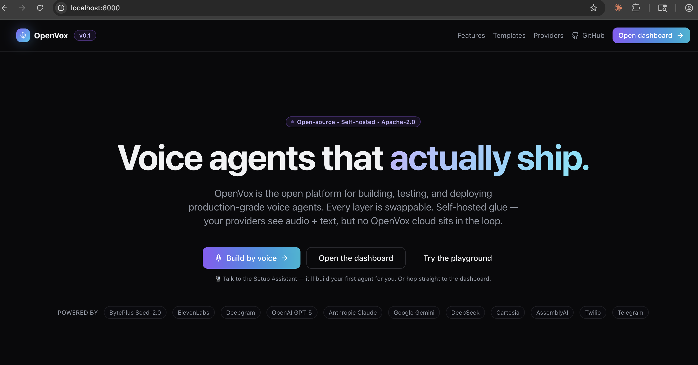
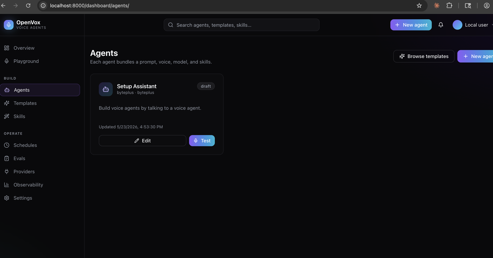

# Install OpenVox

Four install paths, all shipping the same `openvox` binary. Pick whichever
matches your platform and existing tooling.

| # | Path | Best for | One-liner |
|---|---|---|---|
| A | PyPI | Any OS, Python-savvy users | `pip install openvox-core` |
| B | Curl-bash | macOS / Linux, "just run it" | `curl -fsSL https://github.com/amznsri/openvox/releases/latest/download/install.sh \| bash` |
| C | Homebrew | macOS / Linux with brew | `brew install amznsri/openvox/openvox` |
| D | WinGet | Windows | `winget install OpenVox.OpenVox` |

After install, all four expose `openvox` on `$PATH`. Verify with:

```bash
openvox version
openvox info
```

---

## Path A — PyPI

```bash
pip install openvox-core            # latest
pip install 'openvox-core==0.2.0'    # pinned
pip install -U openvox-core         # upgrade in place
```

Recommended on top of [`pipx`](https://pipx.pypa.io) so the install lives
in its own venv and won't conflict with project Python deps:

```bash
pipx install openvox-core
```

> **PEP 668 systems** (Homebrew Python on macOS; Debian/Ubuntu Python
> 3.11+): system `pip install` is blocked by default. Use `pipx`,
> a `venv`, or path B (which handles this for you).

---

## Path B — Curl-bash one-liner

```bash
curl -fsSL https://github.com/amznsri/openvox/releases/latest/download/install.sh | bash
```

What this does:

1. Detects Python 3.11+ (`python3.13` → `python3.12` → `python3.11` →
   `python3`). Bails with an actionable install hint if missing.
2. Picks `pipx` if available, falls back to a `venv` at `~/.openvox/venv`.
   Symlinks the bin into `~/.local/bin/openvox` so the command works
   regardless of where the venv lives.
3. Verifies the bin is on `$PATH` and prints an `export PATH=...` line
   if not.

Override hooks:

| Env var | What it does |
|---|---|
| `OPENVOX_VERSION` | Pin to a specific PyPI release (e.g. `0.2.0`). |
| `OPENVOX_INSTALLER` | Force `pipx` or `venv`. Default: auto. |
| `OPENVOX_PREFIX` | Custom venv location. Default: `~/.openvox/venv`. |
| `OPENVOX_NO_START` | Skip the "start daemon now?" prompt. |

The release pipeline publishes the script + its SHA256 alongside every
GitHub Release. Audit before piping into bash:

```bash
curl -fsSLO https://github.com/amznsri/openvox/releases/latest/download/install.sh
curl -fsSL  https://github.com/amznsri/openvox/releases/latest/download/install.sh.sha256
sha256sum -c install.sh.sha256
less install.sh
bash install.sh
```

---

## Path C — Homebrew

```bash
brew install amznsri/openvox/openvox
```

The first invocation taps `amznsri/homebrew-openvox` automatically. Use
the explicit two-step form to inspect the formula first:

```bash
brew tap amznsri/openvox
brew info openvox
brew install openvox
```

Upgrade with the usual `brew upgrade openvox`.

> **Why not homebrew-core?** Homebrew-core's review queue is multi-week
> and gates on broad reverse-dependency testing. Our own tap lets us
> ship fixes the same day. Decision documented in
> [`PLANNING_SESSION15.md`](./PLANNING_SESSION15.md).

---

## Path D — WinGet (not yet supported)

> **Status (May 2026):** WinGet support is **deferred**. An earlier
> attempt to package the Python wheel as a WinGet portable zip didn't
> work — WinGet's portable installer extracts the zip and looks for a
> runnable `.exe` inside, but pip's `openvox.exe` shim is generated
> at install-time and isn't in the wheel.
>
> Proper WinGet support needs a PyInstaller-packaged self-contained
> `openvox.exe` (~50-100 MB) and ideally a code-signing certificate to
> avoid Windows SmartScreen warnings. Tracked as a follow-up.
>
> **Today's Windows install path: use [Path A — PyPI](#path-a--pypi)**
> in PowerShell:
>
> ```powershell
> pip install openvox-core
> ```
>
> pip generates `openvox.exe` correctly on Windows. Daemon mode
> (`openvox start`) is also wired for Windows via NSSM but hasn't
> been smoke-tested on a real Windows machine — please
> [file an issue](https://github.com/amznsri/openvox/issues) if
> something doesn't work.

---

## Source checkout (contributors)

For development / pre-release:

```bash
git clone https://github.com/amznsri/openvox.git
cd openvox/packages/core
pip install -e .
openvox run
```

`-e` keeps the install editable — any change to `packages/core/openvox/`
takes effect on the next `openvox` invocation, no re-install needed.

---

## After install: foreground vs daemon

OpenVox runs two ways:

```bash
# Foreground — runs until you Ctrl-C. Auto-opens dashboard in browser.
openvox run

# Daemon — runs in the background, survives terminal close, restarts at
# login / reboot. Same network behaviour as `openvox run` but unattached.
openvox start
openvox status
openvox logs -f          # tail ~/.openvox/logs/openvox.log
openvox stop
openvox restart
```

The daemon backend is OS-native:

| OS | Backend | Service file |
|---|---|---|
| macOS | launchd LaunchAgent | `~/Library/LaunchAgents/com.openvox.daemon.plist` |
| Linux | systemd `--user` unit | `~/.config/systemd/user/openvox.service` |
| Windows | Windows Service via NSSM | Service name: `OpenVoxDaemon` |

Logs go to `~/.openvox/logs/openvox.log` on all three.

> **Linux `--user` services and logout**: by default, `systemctl --user`
> services stop when you log out (or when SSH disconnects). For always-
> on operation across logouts, run `loginctl enable-linger $USER` once.

### What a healthy macOS install looks like

The three checkpoints below are what a fresh `pipx install openvox-core
&& openvox start` should produce on macOS. They're also the screenshots
the v0.2.0 smoke test in [`PLANNING_SESSION17.md` §Phase 5](./PLANNING_SESSION17.md)
asks for, captured against v0.1.8.

**1. CLI flow.** `openvox version` → `openvox start` (prints PID, log
paths, and the dashboard URL) → `openvox status` (confirms the PID is
alive) → `ls ~/Library/LaunchAgents/com.openvox.*` (the launchd plist
exists, so the daemon auto-starts on login).


**2. Landing page.** Visit <http://localhost:8000> — the marketing
landing renders, dashboard nav lights up, and the BytePlus/OpenAI/etc.
provider chips confirm the registry registered cleanly.



**3. Dashboard.** <http://localhost:8000/dashboard/agents> shows the
seeded Setup Assistant agent — confirms the SQLite DB is initialised,
migrations ran, and the template auto-seeded.



If any of the three diverges from these (no PID on `status`, blank
dashboard, missing Setup Assistant), the
[Phase 4 wizard error messages](../README.md#troubleshooting) and
`openvox logs` will tell you which startup step broke. The most common
miss is `OPENVOX_INSECURE_TLS=true` for users on corporate proxies —
see [bug #11 in `CLAUDE.md`](../CLAUDE.md#tls--network).

---

## Configuration

OpenVox is local-first. With zero config it runs against SQLite and
the local filesystem — drop API keys in to enable real providers.

The dashboard's first-run wizard handles API keys end-to-end without
the terminal. Open `http://localhost:8000/dashboard` after starting
the server.

For CLI-only / headless setups:

```bash
mkdir -p ~/.openvox
$EDITOR ~/.openvox/.env

# Minimum useful set — one LLM, one voice key:
# BYTEPLUS_LLM_API_KEY=...
# BYTEPLUS_VOICE_API_KEY=...
# (or)
# OPENAI_API_KEY=...
# ELEVENLABS_API_KEY=...
```

`openvox info` after editing prints which keys are recognised (redacted
as `set` / `unset` so the output is safe to paste in a bug report).

---

## Uninstall

```bash
openvox stop                                   # stop daemon if running
# Path A / B: pipx uninstall openvox-core   OR  pip uninstall openvox-core
# Path C:     brew uninstall openvox
# Path D:     winget uninstall OpenVox.OpenVox
rm -rf ~/.openvox                              # config + DB + logs (CAREFUL)
```

On macOS / Linux, also remove the service file if it lingers:

```bash
# macOS
rm -f ~/Library/LaunchAgents/com.openvox.daemon.plist

# Linux
systemctl --user disable openvox.service
rm -f ~/.config/systemd/user/openvox.service
```
